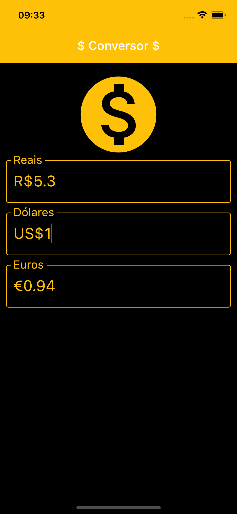

# Conversor de moedas

Este projeto foi desenvolvido no curso [Criação de Apps Android/iOS/Web com Flutter - 5 cursos em 1](https://www.udemy.com/course/curso-completo-flutter-app-android-ios/) ministrado por *Daniel Ciolfi* na plataforma da Udemy.

O APP Conversor de moedas tem como finalidade converter as moedas Real, Dolar e Euro. A conversão é realizada por meio da API da [HGBrasil](https://hgbrasil.com/status/finance).

Para rodar este APP, é necessário criar uma chava na HGBrasil e adicionar esta chave no arquivo .env na raiz do projeto.

